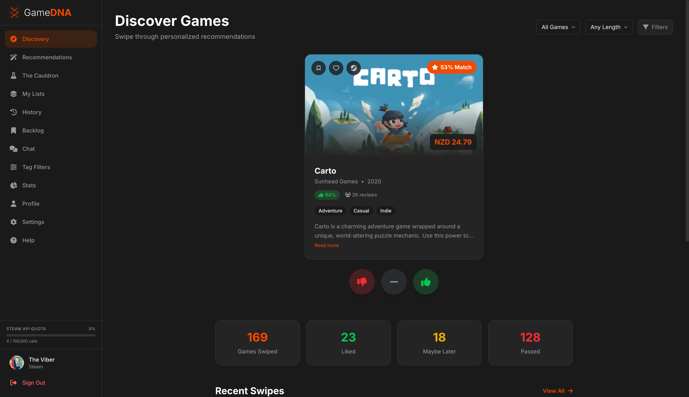
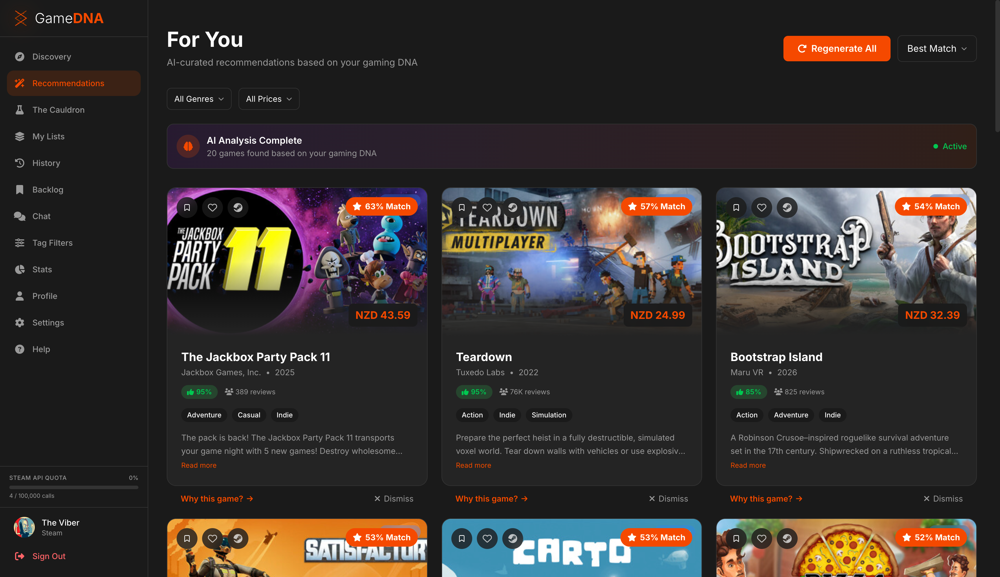
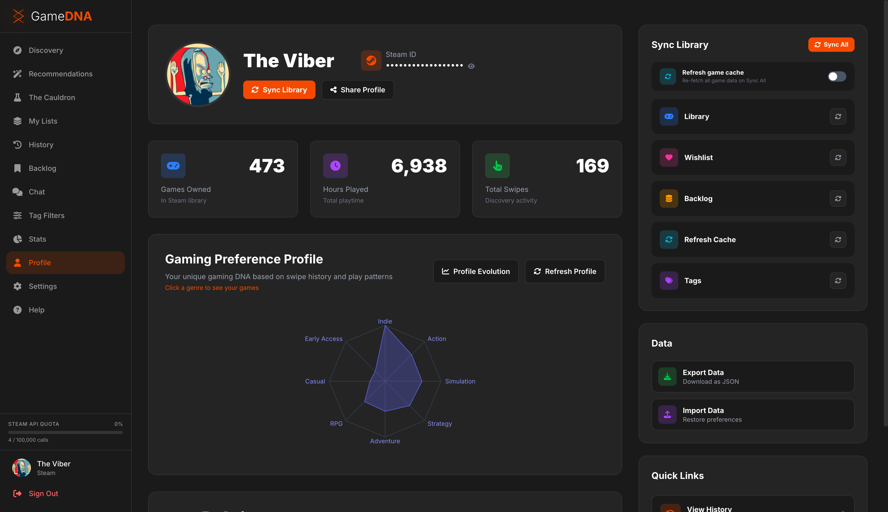
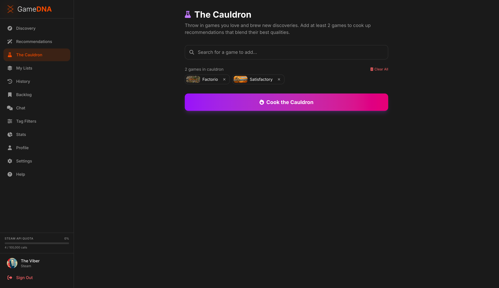
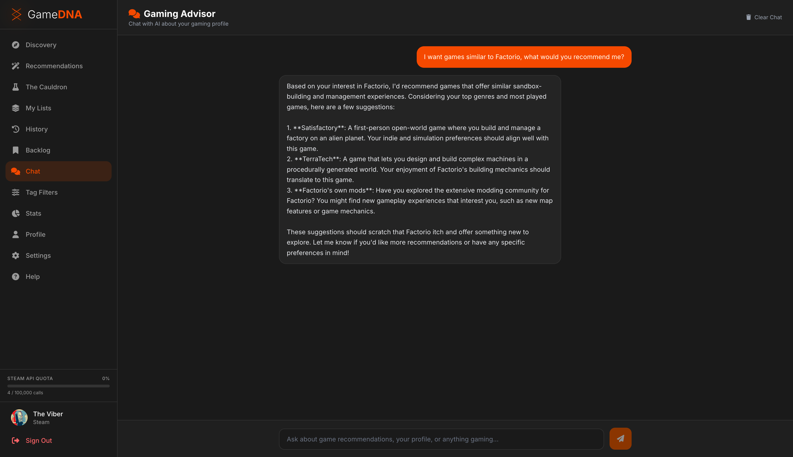
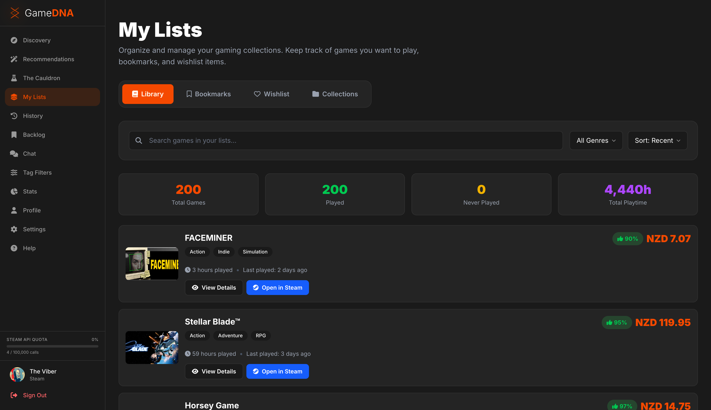
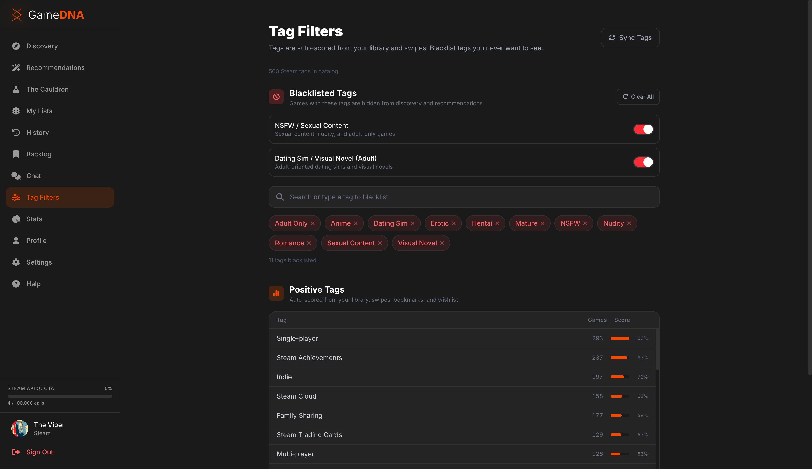
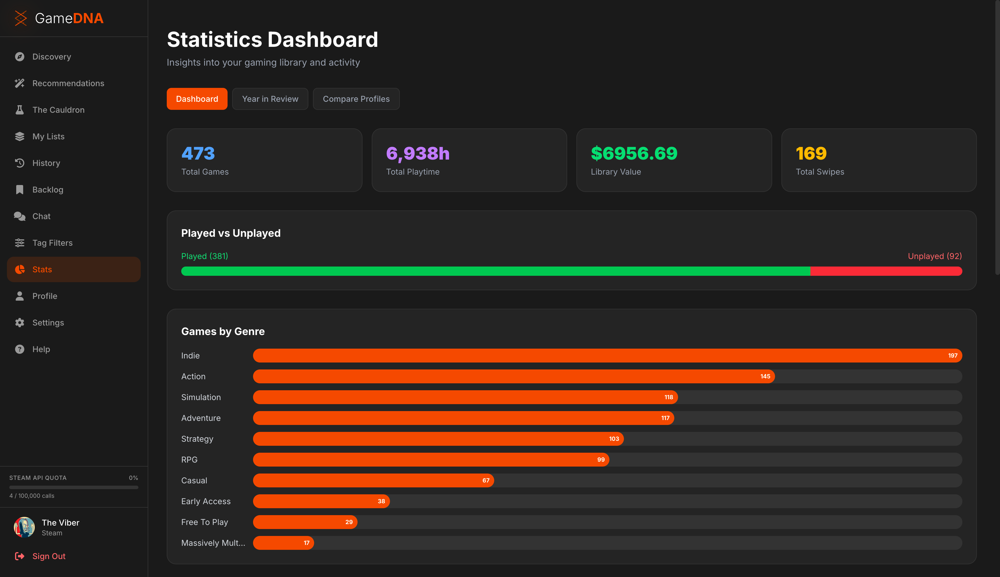

# GameDNA

**Discover your next favorite game — without sacrificing your privacy.**

GameDNA is a Steam game discovery app with a Tinder-style swipe interface, taste profiling, and AI-powered recommendations. All your data stays on your machine. No cloud. No tracking. No external analytics. Just you and your games.



---

## Privacy First

GameDNA was built with a core belief: **your gaming data belongs to you**.

- **Local-first architecture** — Your swipe history, taste profile, preferences, and cached game metadata are stored in a local SQLite database. Nothing is sent to or stored on external servers.
- **No tracking or analytics** — No cookies for tracking, no analytics services, no advertising. The only cookies used are for Steam OpenID authentication.
- **AI runs locally** — Recommendations are powered by a local Ollama instance (Llama 3.1 8B) running on your machine. Your gaming data is never sent to external AI services.
- **Full control over your data** — Export your data as JSON at any time, or delete everything with a single click.


---

## Features

### Swipe-Based Discovery

Browse through Steam's catalog with an intuitive swipe interface. Like, pass, or save games for later — each swipe teaches GameDNA more about your taste.


### AI-Powered Recommendations

Get personalized game recommendations curated by AI based on your unique gaming DNA. Each recommendation includes a match percentage and an explanation of why it was picked for you.



### Gaming DNA Profile

A radar chart visualization of your gaming preferences built from your library, playtime, and swipe history. See how your taste spans across genres like Action, Indie, Strategy, RPG, and more.



### The Cauldron

Throw in games you love and brew new discoveries. Add at least two games and "cook" the cauldron to get recommendations that blend their best qualities.



### Gaming Advisor Chat

Chat with an AI advisor that knows your gaming profile. Ask for recommendations, compare games, or explore new genres — all powered by your local Ollama instance.



### Detailed Game View

Explore game details with media galleries, genre tags, review scores, and quick actions to bookmark, wishlist, or open directly in Steam.


### Library & Lists

Manage your gaming collections. Browse your Steam library, bookmarks, wishlist, and custom collections — all synced from your Steam account.



### Tag Filters

Fine-tune your discovery feed. Blacklist tags you never want to see and view your positively-scored tags auto-generated from your library and swipe history.



### Statistics Dashboard

Deep insights into your gaming library — total games, playtime, library value, genre breakdowns, played vs unplayed ratios, and more.



---

## Getting Started

### Prerequisites

- [Bun](https://bun.sh) runtime
- A [Steam API Key](https://steamcommunity.com/dev/apikey)
- [Ollama](https://ollama.ai) (optional, for AI recommendations)

### Installation

```bash
git clone https://github.com/your-username/gamedna.git
cd gamedna
bun install
```

### Configuration

Copy `.env.example` to `.env` and set your Steam API key:

```bash
cp .env.example .env
```

### Run

```bash
bun run dev
```

This starts both the server (port 3000) and the client (port 5173).

---

## Tech Stack

- **Runtime** — Bun
- **Server** — Hono
- **Client** — React 19 + Vite + Tailwind CSS v4
- **Database** — SQLite (via Drizzle ORM + bun:sqlite)
- **AI** — Ollama (Llama 3.1 8B, runs locally)
- **Auth** — Steam OpenID 2.0

---

## License

This project is open source. See [LICENSE](LICENSE) for details.
